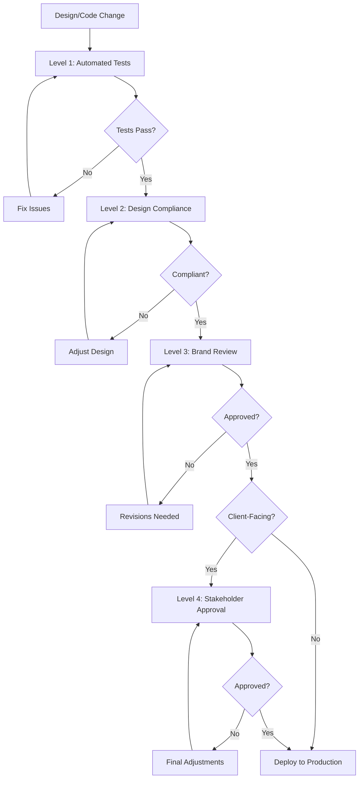

# Design System Lookbook + Brand Inspiration Bundle

**Design FitoutLab Interiors LLC**  
*Premium Design & Fitout Solutions*

---

## 📋 Table of Contents

1. [Introduction & Brand Core](#1-introduction--brand-core)
2. [Quotation & Document Templates](#2-quotation--document-templates)
3. [UI Inspiration Categories](#3-ui-inspiration-categories)
4. [Usage Mapping](#4-usage-mapping)
5. [Workflow Integration](#5-workflow-integration)
6. [Bundle Formats](#6-bundle-formats)
7. [SvNue Validation Requirements](#7-svnue-validation-requirements)
8. [Asset References & Resources](#8-asset-references--resources)

---

## 1. Introduction & Brand Core

### Company Overview

**Design FitoutLab Interiors LLC** is a premium design and fitout solutions provider, leveraging cutting-edge technology and AI-powered workflows to deliver exceptional interior design experiences.

### Brand Ecosystem

The organization operates a multi-brand strategy, each serving distinct purposes within the design and fitout ecosystem:

#### Primary Brands

1. **DesignFitOut** (`designfitout.com`)
   - **Purpose**: Public-facing marketing and client portal
   - **Target**: End clients, prospects, marketing audience
   - **Features**: Portfolio showcase, project galleries, client testimonials
   - **Visual Style**: Premium, elegant, client-friendly

2. **FitOutLab** (`fitoutlab.app`)
   - **Purpose**: Technical design tool and capsule logic platform
   - **Target**: Architects, designers, project managers
   - **Features**: Architecture workflows, technical tools, AI automation
   - **Visual Style**: Technical, professional, tool-oriented

#### Supporting Brands

3. **SvNue** (SeveNue)
   - **Purpose**: Brand verification, dispatch publishing, quotation logic
   - **Target**: Internal validation and content delivery
   - **Features**: Brand compliance checker, publishing workflows, persona storytelling
   - **Visual Style**: Clean, validation-focused, editorial

4. **MrketOz**
   - **Purpose**: E-commerce platform and CRM operations
   - **Target**: Sales teams, customers, retail operations
   - **Features**: Storefront management, customer engagement, lead scoring
   - **Visual Style**: Retail minimalism (inspired by Lululemon), modern e-commerce

5. **SpecLab**
   - **Purpose**: Specification-driven workflows and technical documentation
   - **Target**: Technical teams, compliance officers
   - **Features**: Spec management, material database, regulatory tracking
   - **Visual Style**: Clean cards, mobile-first, utility-focused

6. **DesignPedia**
   - **Purpose**: Design knowledge base and style guide repository
   - **Target**: Designers, students, knowledge seekers
   - **Features**: Design guides, material guidelines, best practices
   - **Visual Style**: Clean 3D interfaces, educational, accessible

7. **fix24**
   - **Purpose**: Diagnostic flows and BOQ normalization
   - **Target**: Quality assurance teams, project auditors
   - **Features**: Automated diagnostics, BOQ workflows, quality checks
   - **Visual Style**: Quick cards, mobile-first, action-oriented

8. **LayrOs**
   - **Purpose**: Invisible monitoring engines and system orchestration
   - **Target**: System administrators, DevOps teams
   - **Features**: Smart home dashboards, system monitoring, invisible engines
   - **Visual Style**: Dark mode dashboards, system metrics, real-time monitoring

9. **LayOps**
   - **Purpose**: Operations and deployment management
   - **Target**: Operations teams, deployment engineers
   - **Features**: Deployment automation, ops dashboards, workflow management
   - **Visual Style**: Technical dashboards, operations-focused, efficiency-driven

### Visual Core

#### Color Palette

**Primary Colors (FitOutLab Signature)**
```
Dark Indigo:    #1a237e  (Primary headers, CTAs)
Medium Blue:    #3949ab  (Secondary elements)
Bright Blue:    #1976d2  (Accents, highlights)
```

**Neutral Palette (Brand-wide)**
```
White:          #ffffff  (Backgrounds, cards)
Light Gray:     #f5f8fb  (Page backgrounds)
Medium Gray:    #666666  (Body text)
Dark Gray:      #333333  (Headlines)
```

**Accent Colors (Beige/Blue FitOutLab)**
```
Light Beige:    #f5f5dc  (Warm accents, quotations)
Soft Blue:      #e3f2fd  (Information boxes)
Deep Purple:    #764ba2  (Gradient overlays)
Teal Accent:    #00f2fe  (Interactive elements)
```

**Functional Colors**
```
Success:        #43e97b  (Confirmations, success states)
Warning:        #f5576c  (Alerts, important notices)
Error:          #f44336  (Error states)
Info:           #2196f3  (Information)
```

#### Typography

**Primary Font Stack**
```css
font-family: 'Inter', -apple-system, BlinkMacSystemFont, 'Segoe UI', Roboto, Arial, sans-serif;
```

**Font Weights**
- Light: 300 (Subtle text, captions)
- Regular: 400 (Body text)
- Medium: 500 (Emphasized text)
- Semi-Bold: 600 (Subheadings)
- Bold: 700 (Headlines, CTAs)

**Type Scale**
```css
H1: clamp(2.5rem, 5vw, 4rem) - Bold
H2: 1.8rem - Medium
H3: 1.4rem - Medium
Body: 1rem - Regular
Small: 0.88rem - Regular
```

#### Design Principles

1. **Glassmorphism Effects**: Frosted glass backgrounds with blur(20px)
2. **Rounded Corners**: 16px for cards, 12px for components, 8px for buttons
3. **Shadows**: Subtle elevation (0 2px 8px rgba(0,0,0,0.09))
4. **Gradients**: Smooth transitions for backgrounds and overlays
5. **Responsive Design**: Mobile-first approach, fluid typography
6. **Animation**: Smooth transitions (300ms ease), purposeful motion
7. **Accessibility**: WCAG 2.1 AA compliance minimum

### Brand Validation Rule

> **All inspirations and design implementations must pass SvNue branding verification before client-facing use.**

This ensures:
- ✅ Color palette compliance
- ✅ Typography consistency
- ✅ Brand alignment
- ❌ No foreign off-brand visual intrusions

---

## 2. Quotation & Document Templates

### Final Quotation Template

#### Visual Identity
- **Logos**: FitOutLab Interior logos (primary placement)
- **Palette**: Beige/Blue FitOutLab signature colors
- **Format**: A4-aligned for professional printing

#### Template Variants

**1. Editable DOCX Format**
```
Filename: FitOutLab-Quotation-Template-v1.docx
Purpose: Internal editing, customization per project
Features:
  - Editable fields for project details
  - Dynamic pricing tables
  - Client information section
  - Terms and conditions (editable)
  - Payment schedule tables
```

**2. Locked PDF Format**
```
Filename: FitOutLab-Quotation-Locked-v1.pdf
Purpose: Client-facing professional document
Features:
  - Fixed branding elements
  - Non-editable pricing
  - Digital signature fields
  - QR code for verification
  - Optional watermark protection
```

#### Document Structure

**Header Section**
- FitOutLab logo (left aligned)
- Document title: "Project Quotation"
- Quotation ID and date
- Company tagline

**Client Information**
- Client name and organization
- Project address
- Contact information
- Project reference number

**Project Overview**
- Project description
- Scope of work
- Timeline estimation
- Key deliverables

**Pricing Breakdown**
- Itemized cost breakdown
- Material specifications
- Labor costs
- Contingency allowance
- Subtotal, taxes, final total

**Footer Section**
- Bank details for payment
- Capsule/Onboarding signals (visual markers)
- Optional watermark: "Generated by FitOutLab AI Engine"
- Terms and conditions reference
- Contact information

#### AI-Generated Quotations

FitOutLab leverages AI automation for quotation generation:

**Features**:
- Automated pricing calculation
- Regional cost adjustments
- Competitive analysis integration
- AI confidence scoring
- Timeline prediction
- Resource optimization

**Reference**: See `fitoutlab/assets/ai-automation-engine.js` for implementation details.

---

## 3. UI Inspiration Categories

### 3.1 Smart Home Dashboards (LayrOs & LayOps)

**Purpose**: System monitoring, invisible infrastructure management

**Visual Characteristics**:
- Dark mode by default (#1a1a1a backgrounds)
- Real-time metrics and charts
- Card-based layouts for different system modules
- Status indicators (green/yellow/red)
- Clean data visualization
- Minimal distractions

**Key Components**:
```
- System Status Cards
  • CPU, Memory, Disk usage
  • Network traffic monitoring
  • Temperature sensors
  • Power consumption metrics

- Alert Panels
  • Critical alerts (red)
  • Warnings (yellow)
  • Information (blue)
  • Dismissable notifications

- Timeline Views
  • Event logs
  • Deployment history
  • System uptime tracking

- Control Panels
  • Start/stop services
  • Configuration toggles
  • Emergency shutdown
```

**Inspiration Sources**:
- Home Assistant dashboards
- Grafana monitoring interfaces
- Nest thermostat controls
- Tesla app system screens

**Implementation Examples**:
- `fitoutlab/index.html` - Capsule deployment status
- Smart home control interfaces
- IoT device management panels

### 3.2 Lifestyle / Utility Apps (fix24, SpecLab)

**Purpose**: Quick actions, mobile-first workflows, utility-focused

**Visual Characteristics**:
- Clean card-based design
- Large touch targets (minimum 44px)
- Progressive disclosure of information
- Swipe gestures support
- Quick action buttons
- Icon-driven navigation

**Key Components**:
```
- Quick Action Cards
  • Fix diagnostic launcher
  • BOQ normalization tool
  • Spec lookup
  • Material finder

- Information Cards
  • Project status
  • Recent activity
  • Notifications
  • Tips and shortcuts

- Form Elements
  • Clean input fields
  • Dropdown selectors
  • File upload areas
  • Submit buttons with loading states

- List Views
  • Spec libraries
  • Material catalogs
  • Diagnostic history
  • Saved templates
```

**Inspiration Sources**:
- Apple Health app
- Google Keep cards
- Notion mobile interface
- Todoist task cards

**Implementation Examples**:
- `designfitout/pages/fix24.html` - Diagnostic workflows
- `designfitout/pages/speclab.html` - Specification management

### 3.3 Clean 3D + Security Interfaces (DesignPedia, FitOutLab)

**Purpose**: Design visualization, technical documentation, secure workflows

**Visual Characteristics**:
- White/light backgrounds (#f5f8fb)
- 3D model previews
- Clean grid layouts
- Secure authentication flows
- Professional typography
- Subtle shadows and depth

**Key Components**:
```
- 3D Viewer Cards
  • Model rotation controls
  • Zoom and pan
  • Material preview
  • Lighting adjustments

- Documentation Panels
  • Style guides
  • Best practices
  • Code examples
  • Image galleries

- Security Elements
  • Login forms with MFA
  • Credential hygiene indicators
  • Audit log displays
  • Permission management

- Knowledge Base
  • Searchable content
  • Category navigation
  • Related articles
  • Bookmark functionality
```

**Inspiration Sources**:
- Sketchfab viewer interfaces
- Figma file browser
- GitHub documentation
- Dropbox Paper layouts

**Implementation Examples**:
- `designfitout/pages/designpedia.html` - Knowledge base
- `public/ind2x.html` - Capsule security credentials

### 3.4 Entertainment & Media (SvNue)

**Purpose**: Persona storytelling, content feeds, editorial publishing

**Visual Characteristics**:
- Magazine-style layouts
- Large hero images
- Dynamic content cards
- Story-driven design
- Rich media integration
- Smooth scrolling animations

**Key Components**:
```
- Story Cards
  • Hero image
  • Headline
  • Excerpt
  • Author and date
  • Read time estimate

- Media Players
  • Video embeds (YouTube)
  • Audio players
  • Image galleries
  • Interactive 3D tours

- Feed Layouts
  • Masonry grids
  • Card stacks
  • Timeline views
  • Featured sections

- Publishing Tools
  • Content editor
  • Media library
  • Scheduling interface
  • Analytics dashboard
```

**Inspiration Sources**:
- Medium article layouts
- Instagram story cards
- Netflix content discovery
- Apple News interface

**Implementation Examples**:
- Editorial content delivery
- Brand storytelling pages
- Portfolio showcases

### 3.5 E-commerce / Storefronts (MrketOz)

**Purpose**: Retail operations, proposal shops, customer engagement

**Visual Characteristics**:
- Retail minimalism (Lululemon-inspired)
- Clean product cards
- Large product imagery
- Prominent CTAs
- Simple checkout flows
- Trust indicators

**Key Components**:
```
- Product Cards
  • High-quality images
  • Price prominently displayed
  • Quick add to cart
  • Wishlist toggle
  • Rating stars

- Category Navigation
  • Mega menus
  • Filter panels
  • Sort options
  • Breadcrumbs

- Shopping Cart
  • Item summary
  • Price breakdown
  • Promo code input
  • Checkout button

- Customer Portal
  • Order history
  • Profile management
  • Saved addresses
  • Payment methods
```

**Inspiration Sources**:
- Lululemon storefront
- Apple Store online
- Shopify themes (minimal)
- Everlane product pages

**Implementation Examples**:
- `pages/next-app/public/mrketoz.html` - Console interface
- CRM customer dashboards
- Proposal generation flows

---

## 4. Usage Mapping

### 4.1 Portfolio/Profile Pages

**Recommended Inspirations**:
- ✅ Lifestyle & Entertainment references (SvNue feeds)
- ✅ Clean 3D interfaces (DesignPedia galleries)
- ✅ E-commerce product cards (MrketOz)

**Visual Guidelines**:
```css
Layout: Grid or Masonry
Cards: Large images with overlay text
Palette: Light backgrounds, brand accent colors
Typography: Inter, 400-600 weights
Spacing: Generous white space (24px+ gaps)
```

**Components to Use**:
- Hero section with animated background
- Project gallery with filtering
- Client testimonials cards
- Team member profiles
- Contact form with glassmorphism

**Reference Files**:
- `public/index.html` - Hero and glassmorphism
- `designfitout/index.html` - Portfolio structure

### 4.2 Dashboards (Ops/Admin)

**Recommended Inspirations**:
- ✅ Smart home + monitoring refs (LayrOs, LayOps)
- ✅ Security interfaces (FitOutLab credentials)
- ✅ Utility app components (fix24 diagnostics)

**Visual Guidelines**:
```css
Layout: Multi-column dashboard grid
Cards: Data visualization widgets
Palette: Dark mode optional (#1a237e base)
Typography: Inter, 400-700 weights
Spacing: Compact for information density
```

**Components to Use**:
- Metric cards (KPIs, stats)
- Real-time charts and graphs
- Activity feed/timeline
- System status indicators
- Quick action buttons
- Navigation sidebar

**Reference Files**:
- `fitoutlab/index.html` - Capsule dashboard
- `public/ind2x.html` - Deployment status

### 4.3 Mobile App (Client-facing)

**Recommended Inspirations**:
- ✅ E-commerce & lifestyle flows (MrketOz)
- ✅ Utility apps (fix24, SpecLab)
- ✅ Clean card designs (all brands)

**Visual Guidelines**:
```css
Layout: Single column, mobile-first
Cards: Touch-friendly (minimum 44px targets)
Palette: Light backgrounds, high contrast text
Typography: Inter, 400-600 weights, larger sizes
Spacing: Generous tap targets (16px+ padding)
```

**Components to Use**:
- Bottom navigation bar
- Swipeable cards
- Pull-to-refresh
- Floating action button
- Modal sheets
- Toast notifications

**Implementation Considerations**:
- Progressive Web App (PWA) support
- Offline functionality
- Touch gestures
- Native-like transitions

### 4.4 Brand Core (Owner/Admin)

**Recommended Inspirations**:
- ✅ Dark/light neutral themes
- ✅ Capsule overlays (FitOutLab)
- ✅ Security dashboards
- ✅ System monitoring interfaces

**Visual Guidelines**:
```css
Layout: Flexible multi-panel layouts
Cards: Modular, draggable widgets
Palette: Neutral with brand accents
Typography: Inter, full weight range
Spacing: Customizable, user preferences
```

**Components to Use**:
- Brand configuration panels
- AI automation controls
- Workflow templates
- Analytics dashboards
- System health monitors
- Audit logs viewer

**Reference Files**:
- `config-manager.js` - Configuration system
- `fitoutlab/assets/ai-automation-engine.js` - AI controls

---

## 5. Workflow Integration

### For Designers

**Starting a New Module**:

1. **Identify Module Type**
   - Determine if it's client-facing, admin, or internal tool
   - Reference the Usage Mapping section

2. **Select Brand Context**
   - Which brand does this module belong to?
   - Review brand visual characteristics

3. **Pull Inspiration References**
   - Choose UI patterns from relevant category
   - Gather color palette and typography specs
   - Review component examples

4. **SvNue Pre-Validation**
   - Check color palette compliance
   - Verify typography consistency
   - Ensure brand alignment
   - Flag any off-brand elements

5. **Build & Iterate**
   - Create initial designs
   - Test with target users
   - Refine based on feedback
   - Final SvNue validation

### For Developers

**Implementing UI Components**:

1. **Review Design Specifications**
   - Understand brand context
   - Identify reusable components
   - Note responsive requirements

2. **Use Existing Patterns**
   ```javascript
   // Reference existing implementations
   // fitoutlab/styles/fitoutlab-styles.css - Base styles
   // public/index.html - Glassmorphism components
   // fitoutlab/assets/ai-automation-engine.js - AI features
   ```

3. **Maintain Brand Neutrality**
   - Use configuration templates
   - Avoid hard-coded cloud references
   - Follow cloud-agnostic principles
   - Run validation tests

4. **Component Development Workflow**
   ```bash
   # 1. Setup local environment
   cp config.template.json config.json
   
   # 2. Run validation tests
   node test-brand-neutrality.js
   node test-mrketoz-crm.js
   
   # 3. Develop component
   # Use existing CSS/JS patterns
   
   # 4. Test locally
   npm run dev
   
   # 5. Validate before commit
   node test-brand-neutrality.js
   ```

5. **Code Review Checklist**
   - [ ] Follows existing design patterns
   - [ ] Responsive on mobile/tablet/desktop
   - [ ] Accessible (WCAG 2.1 AA)
   - [ ] Brand neutral (no hard-coded vendors)
   - [ ] Passes validation tests
   - [ ] Performance optimized

### SvNue Auto-Validation

**Automated Checks**:

✅ **Color Palette Compliance**
```javascript
// Validates against approved color palette
const approvedColors = [
  '#1a237e', '#3949ab', '#1976d2',  // Primary blues
  '#ffffff', '#f5f8fb', '#666666',  // Neutrals
  '#f5f5dc', '#e3f2fd', '#764ba2',  // Accents
];

function validateColors(cssFile) {
  // Extract colors from CSS
  // Compare against approved palette
  // Flag violations
}
```

✅ **Typography Consistency**
```javascript
// Validates font usage
const approvedFonts = ['Inter', 'Segoe UI', 'Arial'];
const approvedWeights = [300, 400, 500, 600, 700];

function validateTypography(cssFile) {
  // Check font families
  // Verify font weights
  // Ensure size scale compliance
}
```

✅ **Brand Alignment**
```javascript
// Checks for off-brand elements
const bannedTerms = ['firebase', 'cloudflare', 'ga4', 'gsc'];

function validateBrandNeutrality(files) {
  // Scan for banned terms
  // Verify configuration usage
  // Check template compliance
}
```

**Validation Command**:
```bash
node test-brand-neutrality.js
```

---

## 6. Bundle Formats

### 6.1 README.md / Markdown Lookbook

**Current Format**: This document (`DesignSystem-Lookbook.md`)

**Purpose**:
- Quick reference for developers
- Documentation for GitHub repository
- Lightweight, easy to update
- Version controlled

**Usage**:
- Keep in repository root
- Link from main README.md
- Reference in contribution guidelines
- Update with design system changes

**Advantages**:
- ✅ Plain text, easy to edit
- ✅ Version control friendly
- ✅ Searchable
- ✅ Can include code examples
- ✅ Links directly to files

### 6.2 PDF Lookbook (Polished Portfolio)

**Format**: Professional PDF document

**Purpose**:
- Client presentations
- External designer briefs
- Stakeholder communication
- Print-ready reference

**Structure**:
```
Cover Page
  - FitOutLab branding
  - Document title
  - Version and date

Table of Contents
  - Clickable navigation

Brand Overview
  - Company introduction
  - Brand ecosystem
  - Visual identity

Design System
  - Color palettes (visual swatches)
  - Typography specimens
  - Component examples
  - Layout patterns

UI Inspiration Gallery
  - Category-based sections
  - Screenshot examples
  - Annotation callouts

Usage Guidelines
  - Implementation examples
  - Do's and don'ts
  - Best practices

Appendix
  - Asset locations
  - Tool requirements
  - Contact information
```

**Generation**:
```bash
# Can be generated from this markdown using tools like:
pandoc DesignSystem-Lookbook.md -o DesignSystem-Lookbook.pdf --pdf-engine=xelatex

# Or using Chrome/Puppeteer:
node -e "require('puppeteer').launch().then(b => b.newPage().then(p => p.goto('file://DesignSystem-Lookbook.md').then(() => p.pdf({path: 'DesignSystem-Lookbook.pdf'}))))"
```

### 6.3 JSON/YAML Configuration Format

**Purpose**: Direct integration with design tools and build systems

**Example Structure**:

```json
{
  "designSystem": {
    "version": "1.0.0",
    "lastUpdated": "2025-01-03",
    "brands": {
      "designfitout": {
        "domain": "designfitout.com",
        "type": "public-facing",
        "allowedInspiration": [
          "lifestyle",
          "entertainment",
          "ecommerce"
        ],
        "palette": {
          "primary": "#1a237e",
          "secondary": "#3949ab",
          "accent": "#1976d2"
        }
      },
      "fitoutlab": {
        "domain": "fitoutlab.app",
        "type": "tool-facing",
        "allowedInspiration": [
          "smart-home",
          "security",
          "utility"
        ],
        "palette": {
          "primary": "#1a237e",
          "secondary": "#3949ab",
          "accent": "#1976d2"
        }
      },
      "svnue": {
        "brand": "SvNue",
        "type": "validation",
        "allowedInspiration": ["entertainment", "media"],
        "validationRules": {
          "colorCompliance": true,
          "typographyCheck": true,
          "brandNeutrality": true
        }
      },
      "mrketoz": {
        "brand": "MrketOz",
        "type": "ecommerce",
        "allowedInspiration": ["ecommerce", "lifestyle"],
        "style": "retail-minimalism"
      },
      "speclab": {
        "brand": "SpecLab",
        "type": "utility",
        "allowedInspiration": ["utility", "mobile-first"],
        "style": "clean-cards"
      },
      "designpedia": {
        "brand": "DesignPedia",
        "type": "knowledge",
        "allowedInspiration": ["3d-interfaces", "documentation"],
        "style": "educational"
      },
      "fix24": {
        "brand": "fix24",
        "type": "diagnostic",
        "allowedInspiration": ["utility", "mobile-first"],
        "style": "action-oriented"
      },
      "layros": {
        "brand": "LayrOs",
        "type": "monitoring",
        "allowedInspiration": ["smart-home", "dashboards"],
        "style": "dark-mode"
      },
      "layops": {
        "brand": "LayOps",
        "type": "operations",
        "allowedInspiration": ["smart-home", "dashboards"],
        "style": "operations-focused"
      }
    },
    "typography": {
      "fontFamily": "Inter",
      "weights": [300, 400, 500, 600, 700],
      "scale": {
        "h1": "clamp(2.5rem, 5vw, 4rem)",
        "h2": "1.8rem",
        "h3": "1.4rem",
        "body": "1rem",
        "small": "0.88rem"
      }
    },
    "components": {
      "glassmorphism": {
        "background": "rgba(255, 255, 255, 0.1)",
        "backdropFilter": "blur(20px)",
        "border": "1px solid rgba(255, 255, 255, 0.2)",
        "borderRadius": "20px"
      },
      "cards": {
        "borderRadius": "16px",
        "shadow": "0 2px 8px rgba(0,0,0,0.09)",
        "padding": "32px"
      },
      "buttons": {
        "borderRadius": "8px",
        "minHeight": "44px",
        "padding": "12px 24px"
      }
    }
  }
}
```

**Integration Example**:
```javascript
// Load design system configuration
const designSystem = require('./DesignSystem-Config.json');

// Validate brand context
function validateBrandUsage(brandName, inspirationType) {
  const brand = designSystem.brands[brandName];
  return brand.allowedInspiration.includes(inspirationType);
}

// Get brand colors
function getBrandPalette(brandName) {
  return designSystem.brands[brandName].palette;
}
```

**File Location**: `examples/DesignSystem-Config.json` (to be created)

### 6.4 Figma Design System Library

**Format**: Figma file with reusable components

**Structure**:
- Color styles library
- Text styles library
- Component library (buttons, cards, forms)
- Layout templates
- Icon set
- Brand logos and assets

**Usage**:
- Designers can pull components into projects
- Ensures consistency across designs
- Auto-updates when library changes
- Collaborative design workflow

**Note**: Requires Figma account and file setup (not included in repository)

---

## 7. SvNue Validation Requirements

### Purpose

SvNue (SeveNue) serves as the brand guardian, ensuring all design implementations maintain:
- Visual consistency across brands
- Color palette compliance
- Typography standards
- Brand neutrality (cloud-agnostic)
- Quality assurance

### Validation Levels

#### Level 1: Automated Pre-Validation (CI/CD)

**Run automatically on every commit:**
```bash
node test-brand-neutrality.js
```

**Checks**:
- ✅ No hard-coded cloud provider references
- ✅ Configuration template usage
- ✅ File structure compliance
- ✅ Required files present

**Pass Criteria**: All tests must pass before merge

#### Level 2: Design System Compliance

**Manual/Semi-Automated Validation:**

**Color Palette Check**:
```javascript
// Scan CSS files for color usage
function validateColorPalette(cssContent) {
  const usedColors = extractColors(cssContent);
  const approvedColors = getApprovedPalette();
  
  const violations = usedColors.filter(
    color => !approvedColors.includes(color)
  );
  
  return {
    passed: violations.length === 0,
    violations: violations,
    message: `Found ${violations.length} unapproved colors`
  };
}
```

**Typography Check**:
```javascript
// Verify font usage compliance
function validateTypography(cssContent) {
  const fontFamilies = extractFontFamilies(cssContent);
  const approvedFonts = ['Inter', 'Segoe UI', 'Arial', 'sans-serif'];
  
  const unapprovedFonts = fontFamilies.filter(
    font => !approvedFonts.includes(font)
  );
  
  return {
    passed: unapprovedFonts.length === 0,
    violations: unapprovedFonts
  };
}
```

#### Level 3: Brand Alignment Review

**Human Review Required for:**
- New brand modules
- Client-facing pages
- Marketing materials
- Major visual updates

**Review Checklist**:
- [ ] Matches brand visual style
- [ ] Appropriate inspiration category
- [ ] Usage mapping followed
- [ ] No off-brand elements
- [ ] Responsive design verified
- [ ] Accessibility standards met
- [ ] Performance acceptable

#### Level 4: Client-Facing Approval

**Final validation before public release:**

**Stakeholder Review**:
- Design lead approval
- Brand manager approval
- Technical lead approval
- Client preview (if applicable)

**Documentation**:
- Screenshot gallery
- Deployment notes
- Rollback procedure
- Monitoring plan

### Validation Workflow



### Validation Commands

**Quick Validation**:
```bash
# Run all automated tests
npm run test:validate

# Or individual tests
node test-brand-neutrality.js
node test-mrketoz-crm.js
```

**Full Validation Suite**:
```bash
# Run all tests including E2E
npm run test:all

# Specific E2E tests
npm run test
npm run test:headed  # Visual browser testing
```

### Violation Handling

**Minor Violations** (Warnings):
- Non-standard but acceptable colors
- Unusual spacing values
- Non-critical typography issues

**Major Violations** (Blockers):
- Hard-coded cloud provider references
- Unapproved fonts
- Off-brand color schemes
- Accessibility failures
- Security vulnerabilities

**Resolution Process**:
1. Automated tests flag violations
2. Developer receives detailed report
3. Fix violations or request exception
4. Re-run validation
5. Proceed when all checks pass

---

## 8. Asset References & Resources

### Repository Structure

```
/home/runner/work/Designfitout-Github/Designfitout-Github/
├── public/
│   ├── index.html                 # Main landing page (glassmorphism)
│   ├── ind2x.html                 # FitOutLab capsule interface
│   └── strategic-analysis.js      # Competitor analysis module
├── designfitout/
│   ├── index.html                 # DesignFitOut main page
│   ├── pages/
│   │   ├── designpedia.html       # Design knowledge base
│   │   ├── fix24.html             # Diagnostic workflows
│   │   ├── speclab.html           # Specification management
│   │   └── login.html             # Authentication page
│   └── styles/
│       └── styles.css             # Main stylesheet
├── fitoutlab/
│   ├── index.html                 # FitOutLab main page
│   ├── styles/
│   │   └── fitoutlab-styles.css   # Technical tool styles
│   ├── assets/
│   │   └── ai-automation-engine.js # AI workflow automation
│   └── tools/                     # Various tool pages
├── pages/
│   └── next-app/public/
│       └── mrketoz.html           # MrketOz console
├── config.template.json           # Configuration template
├── test-brand-neutrality.js       # Validation tests
├── test-mrketoz-crm.js           # CRM tests
└── DesignSystem-Lookbook.md      # This document
```

### Key Files for Reference

#### Visual Design References

**Glassmorphism Implementation**:
- `public/index.html` (lines 44-51): Glass effect styles
- CSS properties: `backdrop-filter: blur(20px)`

**Color Palette Usage**:
- `public/index.html` (lines 17-27): CSS variables
- `fitoutlab/styles/fitoutlab-styles.css` (lines 27-42): Color applications

**Typography**:
- `public/index.html` (line 36): Font stack
- `fitoutlab/styles/fitoutlab-styles.css` (lines 27-48): Type hierarchy

**Component Patterns**:
- `public/index.html`: Cards, buttons, animations
- `fitoutlab/styles/fitoutlab-styles.css`: Form elements, layouts

#### Functional References

**AI Automation**:
- `fitoutlab/assets/ai-automation-engine.js`
  - Quotation generation workflow
  - Pricing calculation
  - Timeline prediction

**Configuration Management**:
- `config.template.json`: Cloud-agnostic configuration
- `config-manager.js`: Configuration utilities

**Testing & Validation**:
- `test-brand-neutrality.js`: Brand compliance tests
- `test-mrketoz-crm.js`: CRM functionality tests

#### Documentation References

**Development Guides**:
- `DEVELOPMENT.md`: Setup and development workflow
- `CONTRIBUTION_GUIDELINES.md`: Code standards and process
- `VIBE_CODING_GUIDE.md`: AI-assisted development

**Configuration Guides**:
- `DUAL_DOMAIN_CONFIG_GUIDE.md`: Multi-domain setup
- `CLOUD_PROVIDERS.md`: Cloud-agnostic deployment

**Feature Documentation**:
- `MRKETOZ_CRM_DOCS.md`: CRM API documentation
- `VIDEO_SIMULATION_DOCS.md`: Video integration features

### External Resources

#### Design Inspiration

**Smart Home / Monitoring**:
- Home Assistant UI: https://www.home-assistant.io
- Grafana Dashboards: https://grafana.com
- Tesla App: https://www.tesla.com/support/tesla-app

**Lifestyle / Utility**:
- Apple Health: https://www.apple.com/ios/health/
- Google Keep: https://keep.google.com
- Notion: https://www.notion.so

**E-commerce**:
- Lululemon: https://www.lululemon.com
- Apple Store: https://www.apple.com/store
- Everlane: https://www.everlane.com

**Documentation / 3D**:
- Sketchfab: https://sketchfab.com
- Figma: https://www.figma.com
- GitHub Docs: https://docs.github.com

#### Design Tools

**Color Palette Tools**:
- Coolors: https://coolors.co
- Adobe Color: https://color.adobe.com
- Material Design Colors: https://material.io/design/color

**Typography Tools**:
- Google Fonts: https://fonts.google.com
- Type Scale: https://type-scale.com
- Font Pair: https://www.fontpair.co

**Component Libraries**:
- Material-UI: https://mui.com
- Tailwind UI: https://tailwindui.com
- Bootstrap: https://getbootstrap.com

#### Development Tools

**Testing**:
- Playwright: https://playwright.dev
- Jest: https://jestjs.io

**Build Tools**:
- Node.js: https://nodejs.org
- npm: https://www.npmjs.com

**Cloud Platforms** (via configuration):
- Google Cloud: https://cloud.google.com
- AWS: https://aws.amazon.com
- Azure: https://azure.microsoft.com

### Asset Locations

#### Logos & Branding

**FitOutLab Logo**:
- Primary: `fitoutlab/assets/logo/` (to be added)
- Variations: Light, dark, monochrome

**Brand Logos**:
- DesignFitOut: `designfitout/assets/logo/`
- MrketOz: `pages/next-app/public/assets/`
- Other brands: TBD

#### Templates

**Quotation Templates**:
- DOCX: `templates/quotations/FitOutLab-Quotation-Template-v1.docx` (to be added)
- PDF: `templates/quotations/FitOutLab-Quotation-Locked-v1.pdf` (to be added)

**Document Templates**:
- Invoice: `templates/documents/`
- Proposal: `templates/documents/`
- Contract: `templates/documents/`

#### UI Components

**Reusable Components**:
- Buttons: See `public/index.html` (CTA button)
- Cards: See `fitoutlab/styles/fitoutlab-styles.css`
- Forms: See `designfitout/pages/login.html`
- Navigation: See various page headers

### Version History

**Version 1.0.0** - January 2025
- Initial Design System Lookbook
- Brand ecosystem documentation
- UI inspiration categories
- Usage mapping guidelines
- Workflow integration process
- SvNue validation framework

### Future Enhancements

**Planned Additions**:
- [ ] Figma design system library
- [ ] Component library (React/Vue)
- [ ] Storybook integration
- [ ] Automated visual regression testing
- [ ] Brand asset management system
- [ ] Interactive component playground
- [ ] Video tutorials for common patterns
- [ ] Contribution templates for new brands

### Contact & Support

**Design System Questions**:
- Email: design@fitoutlab.app
- Repository: https://github.com/support-designfitout/Designfitout-Github
- Issues: Submit via GitHub Issues

**Contribution**:
- Review: `CONTRIBUTION_GUIDELINES.md`
- Process: Pull request workflow
- Standards: Follow this lookbook

---

## Appendix A: Quick Reference

### Color Palette Summary

```css
/* Primary Colors */
--primary-dark:   #1a237e;
--primary-medium: #3949ab;
--primary-light:  #1976d2;

/* Neutrals */
--white:          #ffffff;
--bg-light:       #f5f8fb;
--text-medium:    #666666;
--text-dark:      #333333;

/* Accents */
--beige:          #f5f5dc;
--blue-soft:      #e3f2fd;
--purple:         #764ba2;
--teal:           #00f2fe;

/* Functional */
--success:        #43e97b;
--warning:        #f5576c;
--error:          #f44336;
--info:           #2196f3;
```

### Typography Summary

```css
/* Font Family */
font-family: 'Inter', -apple-system, BlinkMacSystemFont, 'Segoe UI', Roboto, Arial, sans-serif;

/* Font Weights */
300 - Light
400 - Regular
500 - Medium
600 - Semi-Bold
700 - Bold

/* Font Sizes */
H1: clamp(2.5rem, 5vw, 4rem)
H2: 1.8rem
H3: 1.4rem
Body: 1rem
Small: 0.88rem
```

### Component Sizes

```css
/* Border Radius */
Cards: 16px
Components: 12px
Buttons: 8px
Glassmorphism: 20px

/* Shadows */
Standard: 0 2px 8px rgba(0,0,0,0.09)
Glass: 0 8px 32px rgba(0,0,0,0.3)

/* Spacing */
Small: 12px
Medium: 24px
Large: 32px
XLarge: 48px

/* Touch Targets */
Minimum: 44px
Recommended: 48px
```

### Brand-to-Inspiration Mapping

| Brand | Inspiration Categories | Style |
|-------|----------------------|-------|
| DesignFitOut | Lifestyle, Entertainment, E-commerce | Premium, elegant |
| FitOutLab | Smart Home, Security, Utility | Technical, professional |
| SvNue | Entertainment, Media | Editorial, clean |
| MrketOz | E-commerce, Lifestyle | Retail minimalism |
| SpecLab | Utility, Mobile-first | Clean cards |
| DesignPedia | 3D Interfaces, Documentation | Educational |
| fix24 | Utility, Mobile-first | Action-oriented |
| LayrOs | Smart Home, Dashboards | Dark mode, monitoring |
| LayOps | Smart Home, Dashboards | Operations-focused |

### Validation Checklist

- [ ] Run `node test-brand-neutrality.js` ✅
- [ ] Run `node test-mrketoz-crm.js` ✅
- [ ] Color palette compliance ✅
- [ ] Typography consistency ✅
- [ ] Brand neutrality (no vendor lock-in) ✅
- [ ] Responsive design verified ✅
- [ ] Accessibility (WCAG 2.1 AA) ✅
- [ ] Performance optimized ✅
- [ ] SvNue brand review passed ✅

---

## Document Information

**Document**: Design System Lookbook + Brand Inspiration Bundle  
**Version**: 1.0.0  
**Last Updated**: January 2025  
**Author**: Design FitoutLab Interiors LLC  
**Status**: Active  
**Next Review**: Quarterly

**License**: Internal use only - Design FitoutLab Interiors LLC  
**Distribution**: Team members, approved contractors, stakeholders

---

*This document is a living resource and will be updated as the design system evolves. For the latest version, always refer to the repository: `/DesignSystem-Lookbook.md`*
